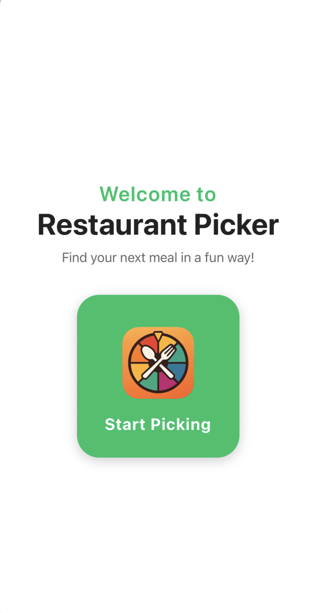

# Restaurant Discovery Platform

A full-stack web application that helps users discover and filter restaurants based on location, cuisine preferences, and advanced filtering options. Built with modern web technologies and integrated with Google Places API for real-time location data and restaurant information.

---

## Demo Video

---

## Overview

Restaurant Discovery Platform streamlines the restaurant discovery process:

1. **Search** by location using Google Places autocomplete with real-time suggestions
2. **Filter** by distance, cuisine type, and other preferences
3. **Discover** restaurants with detailed information and ratings
4. **Explore** comprehensive restaurant data with integrated APIs
5. **Save** favorite locations and search history (Coming Soon)

---

## Features

### Current Features
- **Real-time Search**: Google Places autocomplete with debounced search
- **Location Services**: GPS location detection and address search
- **Advanced Filtering**: Distance, cuisine, rating, and budget filters
- **Responsive Design**: Modern UI built with Tailwind CSS
- **Secure API**: Protected Google Places API integration with rate limiting

### Planned Features (Not Yet Implemented)
- **Heuristic Scoring System**: Restaurant recommendations based on rating + distance + review count
- **AI-Powered Summaries**: Google Places AI-generated restaurant summaries
- **Social Media Integration**: YouTube and TikTok API integration for restaurant content
- **Semantic Search**: pgvector integration for advanced review search and analysis
- **Review Analysis**: LLM-powered "pros/cons" summarization using LangChain RAG tutorials
- **User Accounts**: Authentication system for saving preferences and search history
- **Database Integration**: PostgreSQL with pgvector for semantic search capabilities

---

## Tech Stack

### Frontend
- **Next.js**
- **React** with TypeScript
- **Tailwind CSS** for styling
- **Debounced search** for backend performance optimization

### Backend & APIs
- **Next.js API Routes** for backend services
- **Google Places API v1** for restaurant data
- **Session token management** for cost optimization
- **Rate limiting** and security measures

### Data & Infrastructure
- **PostgreSQL** (planned for reviews and user data)
- **pgvector** (planned for semantic search)
- **LangChain** (planned for LLM integration)

### Security & Performance
- **API key protection** (server-side only)
- **Rate limiting** (100 requests per 15 minutes per IP)
- **Input validation** and error handling
- **Debounced search** (300ms delay)

---